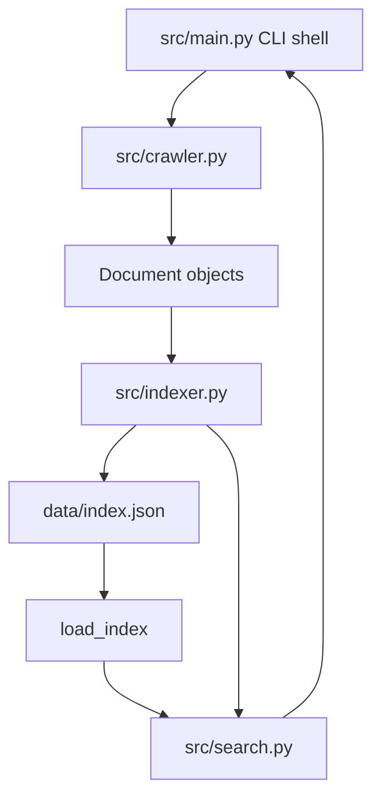

# Search Engine Tool

[](https://github.com/gabrielsaban/search-engine-tool/actions/workflows/ci.yml)

Python command-line search engine for the COMP3011 Web Services and Web Data coursework. It crawls [quotes.toscrape.com](https://quotes.toscrape.com/), builds a positional inverted index, persists the index, and supports the required `build`, `load`, `print`, and `find` commands.

## Features

- Polite crawler with a default 6-second delay between live requests.
- Beautiful Soup HTML parsing for quote text, authors, tags, and pagination.
- Case-insensitive tokenisation.
- Positional inverted index with per-page frequency and token positions.
- JSON persistence via `data/index.json`.
- Boolean AND search for multi-word queries.
- Quoted phrase search using indexed token positions.
- Explicit `OR` queries and close-term suggestions for misspellings.
- TF-IDF-style ranking with deterministic tie-breaking.
- Friendly handling for missing, corrupt, and invalid index files.
- Pytest suite with mocked HTTP and integration coverage.

## Install

```bash
python3 -m venv .venv
source .venv/bin/activate
python -m pip install --upgrade pip
python -m pip install -r requirements.txt -r requirements-dev.txt
```

The project is tested with Python 3.12 in CI.

## Usage

Start the interactive shell:

```bash
python3 -m src.main
```

The default index path is `data/index.json`.

Required commands:

```text
build
load
print <word>
find <query terms>
```

Example session:

```text
> load
Loaded index from data/index.json.
Index contains 849 unique term(s) across 10 page(s).

> print nonsense
nonsense
https://quotes.toscrape.com/page/2/ | frequency=1 | positions=[398]
https://quotes.toscrape.com/page/7/ | frequency=1 | positions=[293]

> find indifference
1. Quotes to Scrape | score=13.5237 | terms=indifference:5 | https://quotes.toscrape.com/page/2/

> find good friends
1. Quotes to Scrape | score=22.7502 | terms=good:3, friends:8 | https://quotes.toscrape.com/page/2/
2. Quotes to Scrape | score=6.0506 | terms=good:1, friends:2 | https://quotes.toscrape.com/page/6/

> find "good friends"
1. Quotes to Scrape | score=22.7502 | terms=good:3, friends:8 | https://quotes.toscrape.com/page/2/

> find indifference OR nonsense
1. Quotes to Scrape | score=13.5237 | terms=indifference:5 | https://quotes.toscrape.com/page/2/
2. Quotes to Scrape | score=2.2993 | terms=nonsense:1 | https://quotes.toscrape.com/page/7/

> find freinds
No matching pages found.
Did you mean: friends?
```

Running `build` with default settings performs a live crawl and waits at least 6 seconds between requests after the first request. The committed `data/index.json` was generated from a full polite crawl of 10 pages on 2026-05-14 and contains 849 unique terms.

For a short development smoke test:

```bash
python3 -m src.main --index-path data/dev-smoke-index.json --max-pages 1 --politeness-delay 0
```

The zero-delay option is for development only; the default remains coursework-compliant.

## Architecture



Core modules:

- `src/crawler.py`: requests pages, applies politeness, extracts text, follows pagination.
- `src/indexer.py`: tokenises documents, builds the inverted index, saves/loads JSON.
- `src/search.py`: formats posting lists, finds pages, ranks results.
- `src/main.py`: interactive command shell.

## Data Model

Inverted index shape:

```python
{
    "good": {
        "https://quotes.toscrape.com/": {
            "frequency": 1,
            "positions": [95],
        }
    }
}
```

Page statistics are stored separately:

```python
{
    "https://quotes.toscrape.com/": {
        "title": "Quotes to Scrape",
        "total_terms": 228,
        "unique_terms": 134,
    }
}
```

## Search Behaviour

Queries use the same tokenisation as indexing. Multi-word queries use AND semantics, so `find good friends` returns only pages containing both terms. Quoted phrases, such as `find "good friends"`, require adjacent token positions. Explicit `OR` queries, such as `find indifference OR nonsense`, return the union of matching clauses.

Ranking uses:

```text
term_frequency * (ln((document_count + 1) / (document_frequency + 1)) + 1)
```

Scores are summed across query terms and rounded to four decimal places for stable output.

## Complexity

- Crawling is `O(number_of_pages)` requests and is dominated by the 6-second politeness delay.
- Indexing is `O(total_terms)` because each token is processed once.
- Looking up `print <word>` is average `O(1)` for the term dictionary lookup plus `O(matching_pages)` to display postings.
- `find <query terms>` intersects posting lists for the query terms, then ranks candidate pages.
- Saved index size is proportional to the number of unique term-page pairs plus stored positions.

## Benchmarking

Run a benchmark against the committed index without live crawling:

```bash
python3 benchmarks/search_benchmark.py --source saved
```

Run a deterministic synthetic benchmark that times tokenisation, index building, and representative queries:

```bash
python3 benchmarks/search_benchmark.py \
  --source synthetic \
  --documents 500 \
  --terms-per-document 120 \
  --vocabulary-size 1000
```

The benchmark reports document count, unique terms, posting count, stored positions, JSON index size, index/load timing, and per-query latency. Use `--query "<query>"` multiple times to benchmark custom searches.

## Testing And Quality

Run the same checks as CI:

```bash
ruff check .
ruff format --check .
mypy
pytest --cov=src --cov-report=term-missing --cov-fail-under=85
```

Current local result:

```text
60 passed
coverage: 96.40%
```

The test suite covers tokenisation, indexing, storage, corrupt index handling, search ranking, CLI flows, mocked crawler behaviour, benchmark helpers, and synthetic corpus search. Live crawling is kept out of CI so tests remain fast and deterministic.

## Documentation

- [Crawler design](docs/crawler-design.md)
- [Indexing design](docs/indexing-design.md)
- [Search design](docs/search-design.md)
- [Search research and rationale](docs/SEARCH_RESEARCH.md)
- [Benchmarking notes](docs/BENCHMARKING.md)
- [CLI design](docs/cli-design.md)
- [Quality checklist](docs/quality-checklist.md)

## References

- Requests documentation: https://requests.readthedocs.io/
- Beautiful Soup documentation: https://www.crummy.com/software/BeautifulSoup/bs4/doc/
- Target website: https://quotes.toscrape.com/
- University module material on crawling, indexing, and search ranking.

## Known Limitations

- Automated tests use mocked HTTP rather than the live site.
- Phrase search is positional and does not include fuzzy phrase matching.
- Ranking is intentionally compact and explainable rather than a production search-engine pipeline.

## Submission Notes

- Compiled index: `data/index.json`
- Main entry point: `src/main.py`
- CI workflow: `.github/workflows/ci.yml`
- The final video should demonstrate `build`, `load`, `print`, `find`, tests, Git/CI, and the required GenAI critical reflection.
